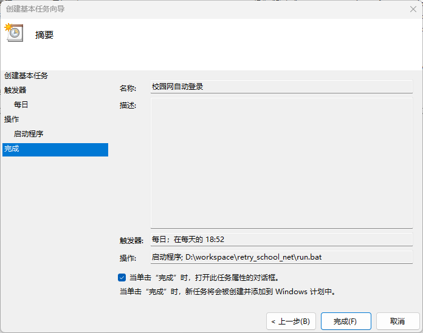
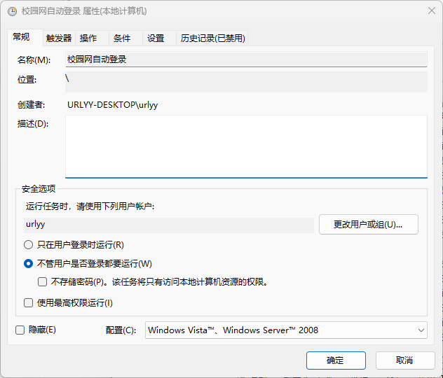
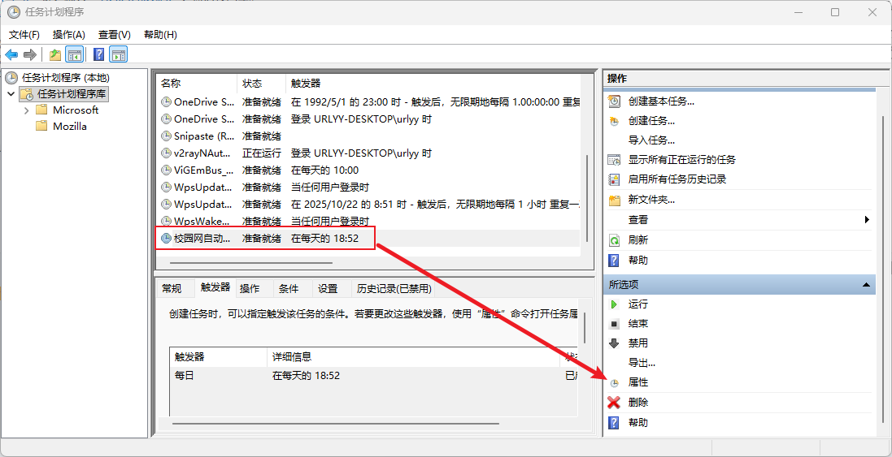
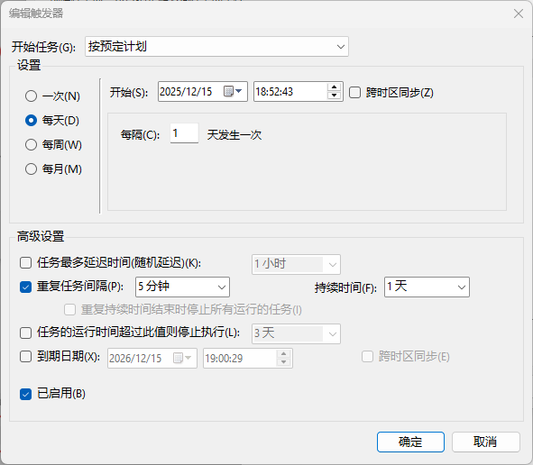

# 🚀 西电广研院-工位主机校园网自动连接器（XDGY-WLAN-Connector）
本项目是一个基于 `Python` 和 `Playwright` 的自动化脚本，用于检测断网情况并自动重连校园网。

> 当前只实现了 Windows 版本。且只能处理已经连上WLAN、但`深澜软件`这个认证界面未登录的情况。

## 🛠️ 项目依赖及安装

### 1\. Python 环境设置

建议使用 **Conda** 或 **Miniconda** 来管理项目环境，以确保依赖的隔离性和稳定性。

```bash
# 1. 创建 Python 虚拟环境
conda create -n xdgy_wlan_connector python==3.12 -y

# 2. 激活环境
conda activate xdgy_wlan_connector

# 3. 安装项目所需的 Python 库 (requests, playwright)
pip install -r requirements.txt
```

### 2\. Playwright 浏览器依赖

本项目使用 Playwright 驱动浏览器进行网页表单的自动填写和提交，因此需要安装对应的浏览器引擎。

```bash
# 安装 Chromium 浏览器引擎
playwright install chromium
```

> **📝 注意：**
> 在 Windows 系统上，Playwright 默认会将浏览器下载到 `C:\Users\<用户名>\AppData\Local\ms-playwright` 目录下。如果未来不再使用本项目，可以手动删除此文件夹以释放空间。

## ⚙️ 配置说明

在使用脚本前，必须配置您的登录信息。

1.  将项目根目录下的 `config_template.json` 文件**重命名**为 `config.json`。
2.  编辑 `config.json` 文件，填入您的校园网登录**学号**和**密码**。

### `config.json` 示例：

```json
{
    "stu_id": "你的学号",
    "password": "你的密码"
}
```

## 💻 运行与使用

确保您已完成上述环境安装和配置步骤后，即可运行主脚本：

```bash
# 确保您当前处于 xdgy_wlan_connector Conda环境中
python main.py
```

### 脚本逻辑概述：

1.  **网络检测**：首先尝试访问百度，如果网络已连接，程序立即退出。
2.  **Wi-Fi 检查 (Windows)**：获取当前连接的 Wi-Fi 名称，并查看当前 Wi-Fi是否是`stu-xdwlan`或`xd-wlan`，如果不是，则程序退出。
3.  **自动登录**：如果满足条件且网络未连接，将启动 Playwright 驱动的浏览器，访问认证页面，自动填写学号和密码并点击登录。
4.  **结果反馈**：再次检测网络状态，并在日志中记录最终结果。

## 使用 `run.bat` 调用脚本

虽然可以直接运行 `python main.py` 进行测试，但在实际使用中，建议通过操作系统的定时任务功能定期调用 `run.bat` 脚本，以实现无人值守的自动化操作。
使用方法为：
1. 在`run.bat`中填写conda路径和虚拟环境名称，方便脚本激活虚拟环境。
2. 根据下面的教程，设置定时任务。

#### Windows-11 定时任务设置示例：

1. 按下 `Win + R` 键，输入 `taskschd.msc`，然后按回车。
2. 点击 `创建基本任务...`。
3. 随便填下`名称`和`描述`，点击`下一页`。
4. `触发器`这里连点两下`下一页`，无需更改，我们后面会做高级更改，这个弹出框里能改的太粗太少。
5. 在`操作`这里选`启动程序`，点击下一页后选到`run.bat`这个文件的绝对路径。点击下一页到达`完成`界面。
6. 为方便，勾选`当单击“完成”时,打开此任务属性的对话框`。点击`完成`按钮，会自动打开一个新面板。

如下：



弹出的新面板如下：


如果没有勾选也没事，如下图操作也可以打开相同面板。



7. 在新面板的`常规`界面，勾选`不管用户是否登录都要运行`。
8. 在`触发器`界面，编辑我们的第一个触发器，设置如下即可：

9. 根据自己的需求，可以在`条件`和`设置`界面进行修改。我这里没有改。


完成后，系统会按照您设置的时间间隔自动运行 `run.bat`，从而实现校园网认证的自动登录。


## 🌍 平台兼容性

| 操作系统 | Wi-Fi 检测功能 | 自动登录功能 (Playwright) | 备注 |
| :---: | :---: | :---: | :--- |
| **Windows** | ✅ 支持 (通过 `netsh wlan`) | ✅ 支持 | 推荐使用 |
| **Linux (Ubuntu/Debian)** | ❌ 暂未实现 | ✅ 支持 | 需要扩展 `get_windows_wifi` 函数以支持 `nmcli` 或其他工具。 |
| **macOS** | ❌ 暂未实现 | ✅ 支持 | 需要扩展 Wi-Fi 获取逻辑。 |


## 📄 日志文件

脚本运行时不会产生大量的控制台输出，但会详细地将运行过程、警告和错误记录到日志文件中。

  * **日志路径**：`./logs/wlan_connector.log`
  * **用途**：用于故障排除和确认每次运行的结果。
  * **滚动压缩策略**：当主日志文件 `(wlan_connector.log)` 大小超过**10MB**时，脚本会自动将其压缩成一个带时间戳的 ZIP 归档文件（例如 `archive_20251215_042000.zip`），并将主日志文件清空重置。
  * **清理策略**：日志目录中只会保留**最新的5个**压缩归档文件，最旧的文件将被自动删除。


同时，脚本会在每次成功连接网络后，将记录写入到 `logs/successful_connections.log` 文件中。该文件不会压缩或滚动删除，保留所有历史记录。旨在帮助用户追踪网络连接历史，便于后续分析。